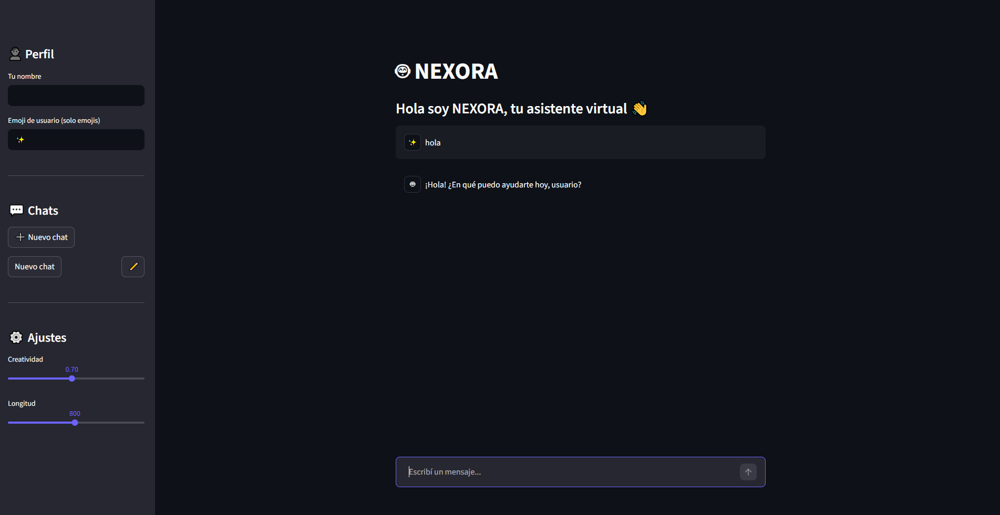
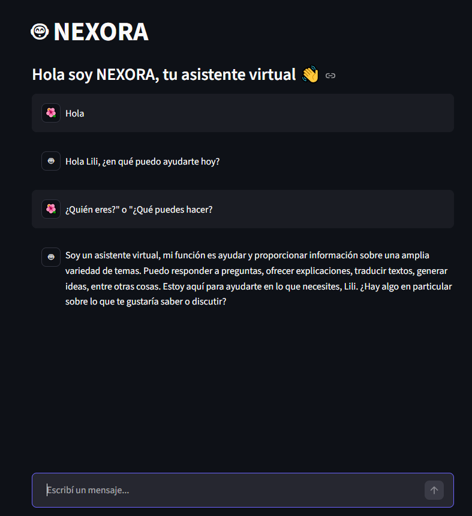
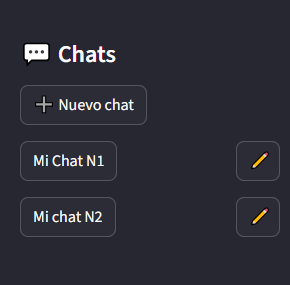
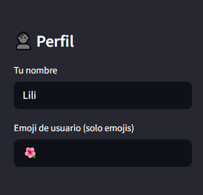
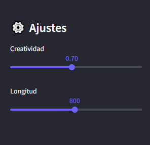

  

## Introducción

**NEXORA** es un chatbot con inteligencia artificial desarrollado en Python que permite mantener conversaciones con un modelo de lenguaje avanzado.  

Funciona como una aplicación web local creada con Streamlit y utiliza la API de Groq para generar respuestas en tiempo real. Está pensado para que cualquier persona pueda usarlo, incluso sin experiencia previa en programación.

La aplicación incluye funciones como creación de nuevos chats, edición de nombres, personalización del usuario con nombre y emoji, y ajustes del comportamiento de la IA como la creatividad de las respuestas o su longitud. Todo esto dentro de una interfaz simple y amigable tipo chat.

---

## Características principales

### Interacción con IA
- Envío de mensajes en tiempo real  
- Procesamiento mediante modelo de lenguaje avanzado  
- Generación de respuestas dinámicas  
- Flujo conversacional continuo  

### Gestión de conversaciones
- Creación de múltiples chats independientes  
- Persistencia del historial durante la sesión  
- Organización de conversaciones por tema  
- Edición de nombres de chats  

### Personalización
- Configuración de nombre de usuario  
- Selección de avatar (emoji)  
- Ajuste de creatividad de respuestas  
- Control de longitud de las respuestas  

### Experiencia de usuario
- Interfaz tipo chat simple y clara  
- Navegación intuitiva  
- Respuestas en tiempo real  
- Uso accesible sin conocimientos técnicos  

---

##  Tecnologías

  

  
  

  
    Python como lenguaje principal • Visual Studio Code como entorno de desarrollo • Streamlit para la interfaz web • Groq para el procesamiento de inteligencia artificial
  

---
## Vista del sistema

<table align="center">
  <tr>
    <td align="center">
       
      Pantalla principal del chatbot
    </td>
  </tr>
</table>

 

<table align="center">
  <tr>
    <td align="center">
       
      Conversación en tiempo real con Nexora
    </td>
  </tr>
</table>

 

<table align="center">
  <tr>
    <td align="center">
       
      Chats
    </td>
    <td align="center">
       
      Perfil
    </td>
    <td align="center">
       
      Ajustes
    </td>
  </tr>
</table>

---
---

## [Instalación del proyecto](./Documentación/Nexora%20-%20Documentación.pdf)

Para usar NEXORA necesitás:

<ul>
  <li>Python 3 o superior</li>
  <li>Conexión a internet</li>
</ul>

<pre><code>python --version</code></pre>

### Paso 1: Descargar el proyecto

<pre><code>git clone https://github.com/Renaaa189/Nexora.git
cd Nexora</code></pre>

### Paso 2: Instalar dependencias

<pre><code>pip install -r requirements.txt</code></pre>

### Paso 3: Configurar API Key</h3>

<ul>
  <li>Crear cuenta en https://console.groq.com/</li>
  <li>Generar una API Key</li>
</ul>

Crear archivo:

<pre><code>.streamlit/secrets.toml</code></pre>

Agregar:

<pre><code>CLAVE_API = "TU_API_KEY"</code></pre>

### Paso 4: Ejecutar la app</h3>

<pre><code>streamlit run chatbot.py</code></pre>

Abrir en el navegador:

<pre><code>http://localhost:8505/</code></pre>

